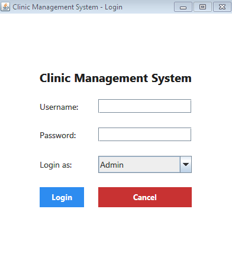
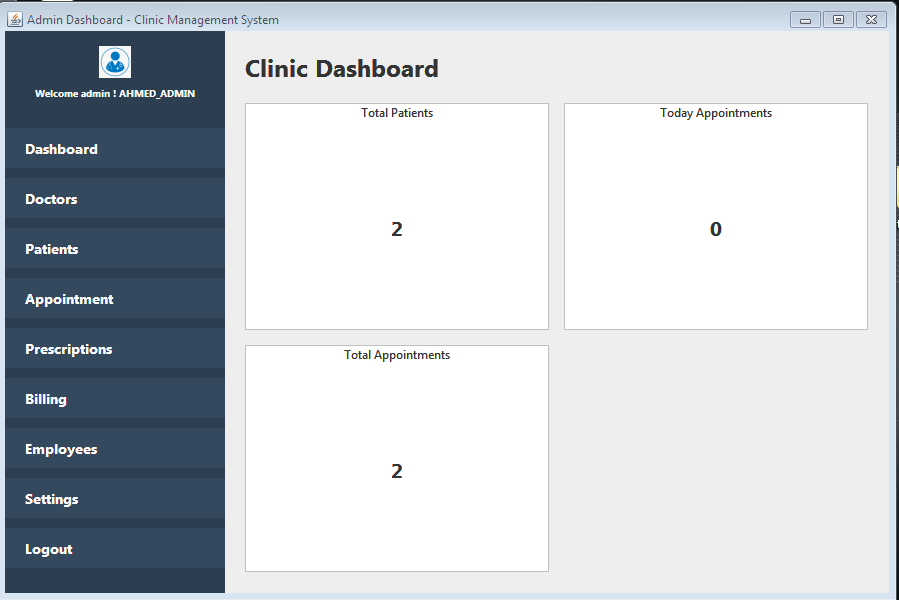
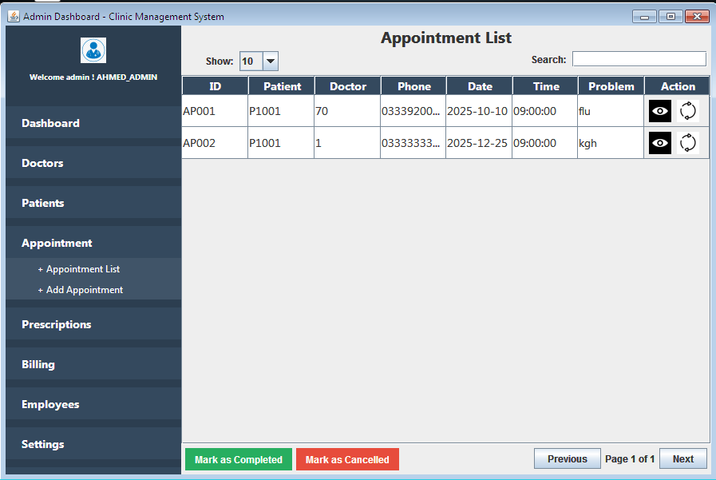
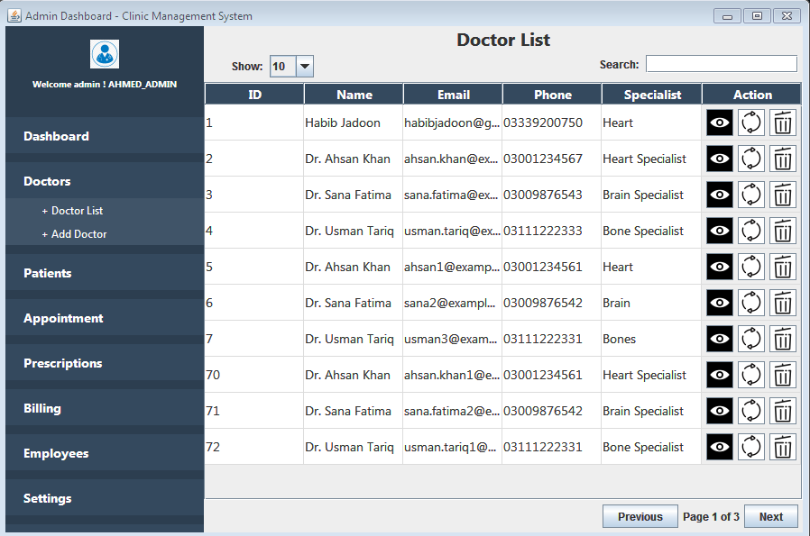

# 🏥 Clinic Management System

A complete **Clinic Management System** developed in **Java Swing** with **MySQL** database integration, designed to help streamline the day-to-day operations of a medical clinic. This project was created as part of a university semester final and won **3rd place** in the inter-course project competition. 🎉

---

## 💡 Features

- 👨‍⚕️ Role-Based Login System (Admin, Doctor, Receptionist)
- 📅 Appointment Booking & Management
- 🧾 Patient Billing with Tax Calculation & "Mark as Paid"
- 🧍 Patient Record Management
- 📋 Medical Records (Diagnosis, Treatment, Doctor Info)
- 💊 Medicine Inventory Management
- 👥 User & Role Management (Add/Edit/Delete Users)
- 🔐 Change Password Module
- 🔎 Searchable Lists with Pagination
- 📊 Clean Swing UI using `GridBagLayout` & JTable

---

## 🛠️ Tech Stack

- **Language**: Java (Swing)
- **Database**: MySQL
- **IDE**: NetBeans
- **JDBC**: For DB connectivity


---


## 📂 Project Structure

```

ClinicManagementSystem/
├── src/
│   ├── clinicmanagementsystem/
│   ├── panels/
│   ├── frames/
│   └── util/
├── nbproject/
├── README.md
└── setup.sql        

````

---

## 🚀 How to Run

1. Clone the repo:
   ```bash
   git clone https://github.com/edevbad/clinic-management-system.git


2. Import into NetBeans (or any Java IDE)
3. Set up MySQL Database using `Database.sql` (if provided)
4. Update DB credentials in the `Conn.java` class
5. Run the application from `Run/ClinicManagementSystem.java`

---

## 📸 Screenshots

### 🔐 Login Page


### 🏥 Dashboard


### 📅 Appointments


### 💵 Doctors



---

## 🎓 Acknowledgements

This project was developed as part of the final semester coursework at COMSATS Islamabad Abbottabad Campus, and secured **3rd place** in the Spring 2025 inter-course project competition.

---

## 📬 Contact

* **Developer**: Ebad Khan
* **GitHub**: [@edevbad](https://github.com/edevbad)
* **LinkedIn**: [Ebad Khan
](www.linkedin.com/in/ebad-khan-4a3ba5377)

---

## 📝 License

This project is open-source and free to use for educational purposes.


